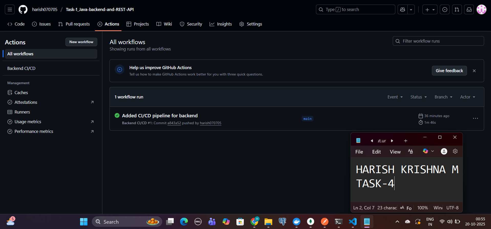
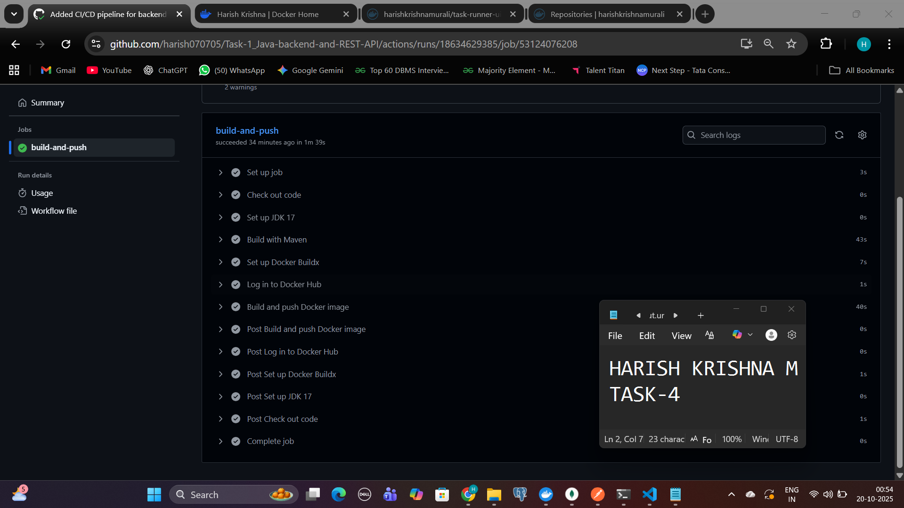
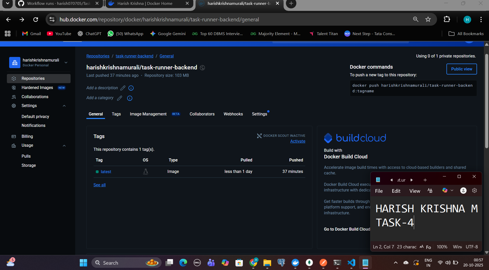
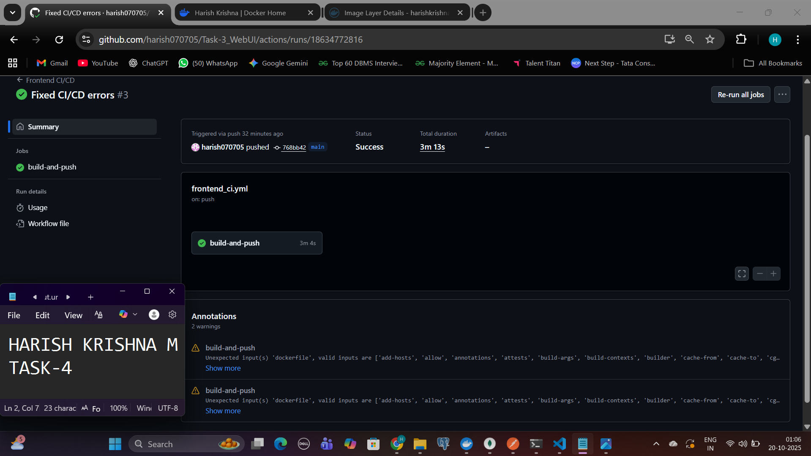
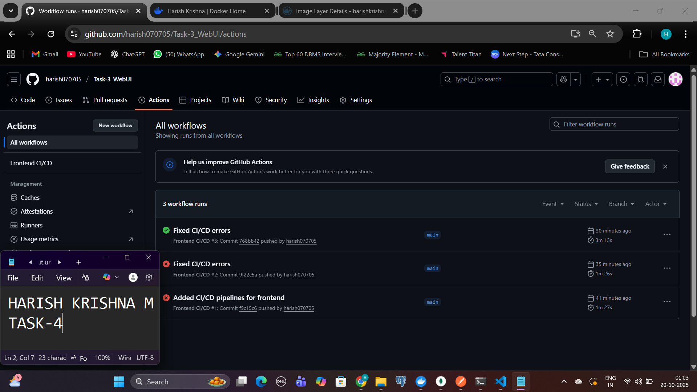
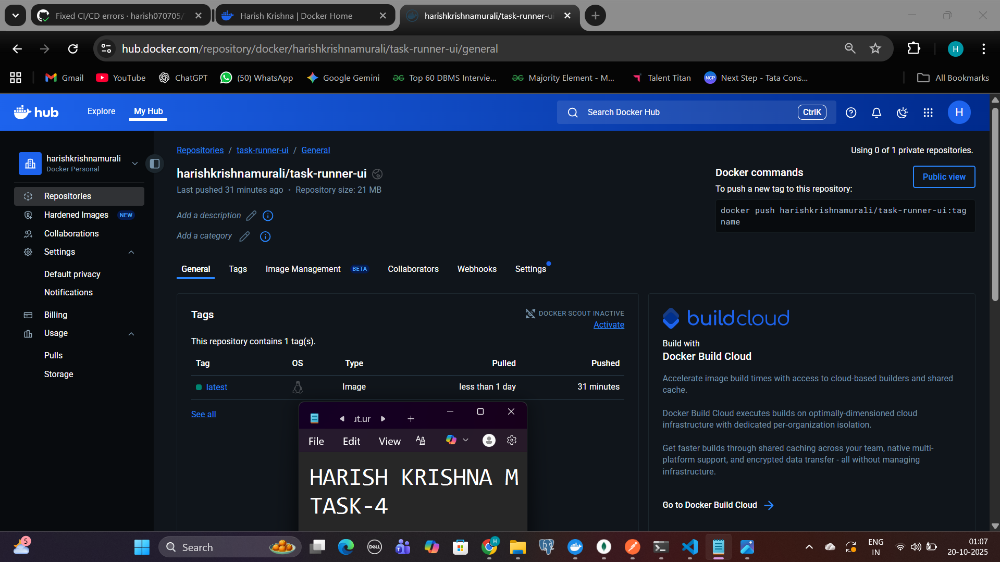

# Task 4: CI/CD Pipeline for Task Runner Application

This document presents the successful implementation of a **Continuous Integration and Continuous Delivery (CI/CD)** pipeline for the **Task Runner** application, which integrates a **Java Spring Boot backend** (Task 1) and a **React frontend** (Task 3).

The entire pipeline is built and automated using **GitHub Actions** and **Docker**, ensuring seamless integration, build, testing, and deployment workflows for both microservices.

---

## 1. Project Overview

The **Task Runner** system consists of:

- **Backend Service (Task 1):** A Java-based REST API built using Spring Boot.
- **Frontend Service (Task 3):** A React-based web UI for task management.

To maintain modularity and ensure independent deployment, **two separate CI/CD pipelines** were developed—one for each service.  
Each pipeline runs automatically whenever a commit or push is made to the `main` branch of its repository.

---

## 2. CI/CD Workflow Summary

### **Backend (Task 1: Java Spring Boot)**

- **Repository:** [Task-1_Java-backend-and-REST-API](https://github.com/harish070705/Task-1_Java-backend-and-REST-API)
- **Pipeline Purpose:**
  - Build and package Java code using Maven
  - Create a production-ready `.jar` file
  - Build a Docker image using multi-stage Dockerfile
  - Push the image automatically to Docker Hub
- **Docker Image Repository:**  
  [harishkrishnamurali/task-runner-backend](https://hub.docker.com/u/harishkrishnamurali)

**Pipeline Outcome:**  
Every successful push to the `main` branch triggers an automated workflow that compiles, tests, and containerizes the backend into a lightweight image, ready for deployment.

---

### **Frontend (Task 3: React UI)**

- **Repository:** [Task-3_WebUI](https://github.com/harish070705/Task-3_WebUI)
- **Pipeline Purpose:**
  - Install dependencies and build React code using Node.js
  - Generate production-ready static assets
  - Package the built files into a Docker image using `nginx`
  - Push the image to Docker Hub
- **Docker Image Repository:**  
  [harishkrishnamurali/task-runner-ui](https://hub.docker.com/u/harishkrishnamurali)

**Pipeline Outcome:**  
Each code update automatically triggers the build and deployment process, ensuring the frontend remains synchronized with the latest changes.

---

## 3. CI/CD Pipeline Features

Both pipelines share a common set of CI/CD best practices and automation principles:

| Stage                            | Description                                                             |
| -------------------------------- | ----------------------------------------------------------------------- |
| **1. Source Checkout**           | Automatically fetches the latest source code from GitHub upon push.     |
| **2. Build Phase**               | Maven builds for backend, and Node.js builds for frontend.              |
| **3. Docker Image Creation**     | Multi-stage Docker builds optimize image size and performance.          |
| **4. Docker Hub Authentication** | Secure login using encrypted GitHub Secrets.                            |
| **5. Image Publication**         | Automatically pushes Docker images with the `latest` tag to Docker Hub. |
| **6. Continuous Delivery**       | Ensures production-ready images are always available for deployment.    |

---

## 4. Tools & Technologies Used

| Category               | Tools/Technologies                                |
| ---------------------- | ------------------------------------------------- |
| **CI/CD Automation**   | GitHub Actions                                    |
| **Containerization**   | Docker, Docker Hub                                |
| **Backend Stack**      | Java, Spring Boot, Maven                          |
| **Frontend Stack**     | React.js, TypeScript, Node.js, Nginx              |
| **Version Control**    | Git, GitHub                                       |
| **Secrets Management** | GitHub Encrypted Secrets (Docker Hub Credentials) |

---

## 5. Pipeline Execution & Artifacts

### **Backend Pipeline**

- Successful GitHub Actions build and deployment run.
- Docker image pushed to Docker Hub:  
  `harishkrishnamurali/task-runner-backend:latest`

Screenshots:  
  
  

---

### **Frontend Pipeline**

- Automated React build and Docker packaging.
- Docker image pushed to Docker Hub:  
  `harishkrishnamurali/task-runner-ui:latest`

Screenshots:  
  
  

---

## 6. Verification Links

| Component                        | Link                                                                                             |
| -------------------------------- | ------------------------------------------------------------------------------------------------ |
| **Backend GitHub Actions Runs**  | [View Backend Actions](https://github.com/harish070705/Task-1_Java-backend-and-REST-API/actions) |
| **Frontend GitHub Actions Runs** | [View Frontend Actions](https://github.com/harish070705/Task-3_WebUI/actions)                    |
| **Docker Hub Profile**           | [harishkrishnamurali](https://hub.docker.com/u/harishkrishnamurali)                              |

---

## 7. Outcome

The final CI/CD setup ensures:

- Fully automated build and deployment pipelines for both backend and frontend.
- Reliable delivery of tested and containerized application components.
- Seamless integration with Docker Hub for deployment readiness.

This implementation demonstrates end-to-end automation, following modern DevOps best practices for **microservice-based applications**.

---
