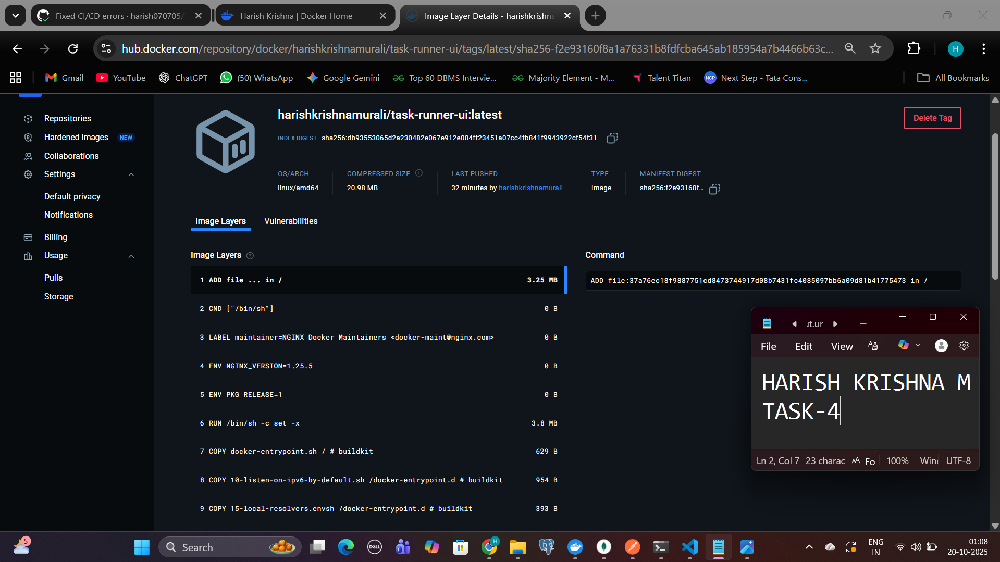

# Task 4:CI/CD Pipeline for Task Runner Application

This repository documents the successful creation of a full CI/CD (Continuous Integration / Continuous Delivery) pipeline for the full-stack "Task Runner" application, which is composed of a Java backend (Task 1) and a React frontend (Task 3).
The pipeline was built using **GitHub Actions** and automates all code builds and Docker image publications.

# 1. Overview of the Pipelines

Two separate, independent CI/CD pipelines were created, which is a best practice for a decoupled, microservice-style application. Both pipelines are automatically triggered on every `git push` to the `main` branch of their respective repositories.

- Backend Pipeline: Compiles the Java code, builds a `.jar`, and packages it into a Docker image.
- Frontend Pipeline: Compiles the React/TypeScript code, builds static files, and packages them into a lightweight `nginx` Docker image.

# 2. Backend Pipeline (Task-1: Java)

This pipeline handles the CI/CD for the Spring Boot backend.

- Source Code Repository: `https://github.com/harish070705/Task-1_Java-backend-and-REST-API `

# Code Snippets

<details>
<summary><strong>Dockerfile (Backend)</strong></summary>
```dockerfile
# Stage 1: Build the application
FROM maven:3.9-eclipse-temurin-17-alpine AS build
WORKDIR /app
COPY pom.xml .
COPY .mvn .mvn
COPY src src
# This runs the "code build" step using Maven
RUN mvn package -DskipTests

# Stage 2: Create the final, small image

FROM eclipse-temurin:17-jre-alpine
WORKDIR /opt/app

# Copy the built jar from the 'build' stage

COPY --from=build /app/target/\*.jar app.jar

# Set the port the app runs on

EXPOSE 9090

# Command to run the application

ENTRYPOINT ["java", "-jar", "app.jar"]

````

\</details\>

\<details\>
\<summary\>\<strong\>GitHub Actions Workflow (.github/workflows/backend-ci.yml)\</strong\>\</summary\>

```yaml
name: Backend CI/CD

on:
  push:
    branches: [ "main" ]

jobs:
  build-and-push:
    runs-on: ubuntu-latest
    steps:
      - name: Check out code
        uses: actions/checkout@v4

      - name: Set up JDK 17
        uses: actions/setup-java@v4
        with:
          java-version: '17'
          distribution: 'temurin'

      # 3. == CODE BUILD STEP ==
      - name: Build with Maven
        run: mvn -B package --file pom.xml

      - name: Set up Docker Buildx
        uses: docker/setup-buildx-action@v3

      - name: Log in to Docker Hub
        uses: docker/login-action@v3
        with:
          username: ${{ secrets.DOCKERHUB_USERNAME }}
          password: ${{ secrets.DOCKERHUB_TOKEN }}

      # 6. == DOCKER BUILD STEP ==
      - name: Build and push Docker image
        uses: docker/build-push-action@v5
        with:
          context: .
          dockerfile: Dockerfile
          push: true
          tags: ${{ secrets.DOCKERHUB_USERNAME }}/task-runner-backend:latest
```

\</details\>

# Pipeline & Artifact Screenshots

GitHub Actions Run (Backend):
A successful pipeline run, showing all steps (Code Build, Docker Build) passed.


Docker Hub Result (Backend):
The final `task-runner-backend` image pushed to Docker Hub, tagged as "latest".


## 3. Frontend Pipeline (task-runner-ui: React)

This pipeline handles the CI/CD for the React frontend.

  * Source Code Repository: `https://github.com/harish070705/Task-3_WebUI`

### Code Snippets

\<details\>
\<summary\>\<strong\>Dockerfile (Frontend)\</strong\>\</summary\>

```dockerfile
# Stage 1: Build the React app
FROM node:18-alpine AS build
WORKDIR /app
COPY package*.json ./
# Use 'npm ci' for faster, more reliable CI builds
RUN npm ci
COPY . .
# This runs the "code build" step
RUN npm run build

# Stage 2: Serve the static files with Nginx
FROM nginx:1.25-alpine
# Copy the built files from Stage 1
COPY --from=build /app/build /usr/share/nginx/html
# Copy our custom Nginx config
COPY nginx.conf /etc/nginx/conf.d/default.conf
EXPOSE 80
CMD ["nginx", "-g", "daemon off;"]
```

\</details\>

\<details\>
\<summary\>\<strong\>nginx.conf\</strong\>\</summary\>

```nginx
server {
  listen 80;
  server_name localhost;

  location / {
    root   /usr/share/nginx/html;
    index  index.html index.htm;
    # This line redirects all 404s to index.html,
    # allowing React Router to handle the URL.
    try_files $uri $uri/ /index.html;
  }
}
```

\</details\>

\<details\>
\<summary\>\<strong\>GitHub Actions Workflow (.github/workflows/frontend-ci.yml)\</strong\>\</summary\>

```yaml
name: Frontend CI/CD

on:
  push:
    branches: [ "main" ]

jobs:
  build-and-push:
    runs-on: ubuntu-latest
    steps:
      - name: Check out code
        uses: actions/checkout@v4

      - name: Set up Node.js
        uses: actions/setup-node@v4
        with:
          node-version: 18

      # 3. == CODE BUILD STEP ==
      - name: Install dependencies
        run: npm ci
      - name: Build React App
        run: npm run build

      - name: Set up Docker Buildx
        uses: docker/setup-buildx-action@v3

      - name: Log in to Docker Hub
        uses: docker/login-action@v3
        with:
          username: ${{ secrets.DOCKERHUB_USERNAME }}
          password: ${{ secrets.DOCKERHUB_TOKEN }}

      # 6. == DOCKER BUILD STEP ==
      - name: Build and push Docker image
        uses: docker/build-push-action@v5
        with:
          context: .
          dockerfile: Dockerfile
          push: true
          tags: ${{ secrets.DOCKERHUB_USERNAME }}/task-runner-ui:latest
```

\</details\>

#Pipeline & Artifact Screenshots
GitHub Actions Run (Frontend):
A successful pipeline run for the frontend, showing the `npm run build` and Docker push steps.


Docker Hub Result (Frontend):
The final `task-runner-ui` image pushed to Docker Hub, tagged as "latest".




# 4. Final Verification Links

  * Backend Pipeline Runs: `https://github.com/harish070705/Task-1_Java-backend-and-REST-API/actions`
  * Frontend Pipeline Runs: `https://github.com/harish070705/Task-3_WebUI/actions`
  * Docker Hub Profile: `https://hub.docker.com/u/harishkrishnamurali`

````
